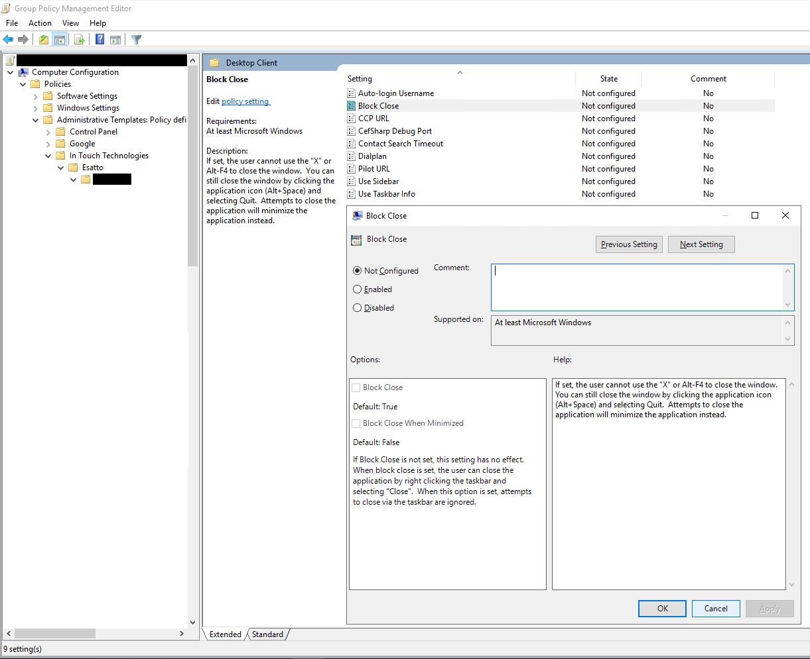

# Esatto Win32 Registry

Allows use of Registry to store config and preferences via MEDC or wrapper classes.

## Microsoft.Extensions.Configuration

Use `IConfigurationBuilder.AddRegistry` to incorporate values from the registry into MEDC.  Keys
created under the path specified will be added as values will be added recursively.  On 
non-windows platforms (Linux, MacOS) the call has no effect.

Example registry settings:

    Set-ItemProperty -Path HKLM:\Software\Company Name\Product -Name "Setting1" -Value "Example value" -Type String

Example use:

    var builder = WebApplication.CreateBuilder(args);
    builder.Configuration
        .AddRegistry(@"Software\Company Name\Product")
        .AddJsonFile("appsettings.json", optional: true)
        .AddEnvironmentVariables();

    var exampleConfig = builder.Configuration.GetSection("Example").Get<ExampleAppSettings>();
    Assert.AreEqual("Example value", exampleConfig?.Setting1);

    class ExampleAppSettings 
    {
        public string? Setting1 { get; set; }
    }

## Wrapper classes

Inherit from `RegistrySettings` to create a wrapper class that exposes a key for 
read/write.  Writes are only made to HKCU.  Changes are monitored and trigger 
events.  Reads are "live" so setting changes in one app are immediately available 
in other copies of the app.

Types supported:

|Registry Type|.Net Type|Get|Set|
|-|-|-|-|
|`REG_DWORD`|`int`|`GetInt`|`SetInt`|
|`REG_DWORD` (`1` or `0`)|`bool` (`value != 0`)|`GetBool`|`SetBool`|
|`REG_DWORD` (milliseconds)|`TimeSpan`|`GetTimeSpan`|`SetTimeSpan`|
|`REG_SZ`|`string`|`GetString`|`SetString`|
|`REG_SZ` (`enum.ToString()`)|`Enum` (`enum.Parse`)|`GetEnum<T>`|`SetEnum<T>`|
|`REG_EXPAND_SZ`|`string[]`|`GetMultiString`|`SetMultiString`|

Settings are pulled in via first match from:

1. User Group Policy (`HKCU\Policies\{Path}`)
2. Computer Group Policy (`HKLM\Policies\{Path}`)
3. User registry (`HKCU\{Path}`)
4. Computer registry (`HKLM\{Path}`)

Example use:

    Console.WriteLine(ExampleSettings.Instance.ReceiptCodeValidityPeriod);
    ExampleSettings.Instance.ServerName = "example.com";

    internal sealed class ExampleSettings : RegistrySettings
    {
        public static ExampleSettings Instance { get; } = new();

        public ExampleSettings()
            : base(@"Company Name\Product Name")
        {
        }

        public int ReceiptCodeValidityPeriod
        {
            get => GetInt(nameof(ReceiptCodeValidityPeriod), 60);
            set => SetInt(nameof(ReceiptCodeValidityPeriod), value);
        }

        public string ServerName
        {
            get => GetString(nameof(ServerName), null);
            set => SetString(nameof(ServerName), value);
        }

        public bool AutoConnect
        {
            get => GetBool(nameof(AutoConnect), false);
            set => SetBool(nameof(AutoConnect), value);
        }

        public string[] RecentDocuments
        {
            get => GetBool(nameof(RecentDocuments), new string[0]);
            set => SetBool(nameof(RecentDocuments), value);
        }
    }

Subkeys may be exposed as nested `RegistrySettings` instances to permit lists / dictionaries.

## ADMX Export for Wrapper Classes

Annotate the wrapper class to auto-generate ADMX files for group policy.  Export the ADMX files with 
Esatto.Win32.AdmxExporter.  The ADMX files can then be loaded into Active Directory by adding them to
the [group policy central store](https://learn.microsoft.com/en-us/troubleshoot/windows-client/group-policy/create-and-manage-central-store#updating-the-administrative-templates-files), or by uploading them to Intune or another MDM.

* The path will be used to organize the settings ("In Touch Technologies > Example Product > Desktop Client" in the example).
* `DisplayName` will set the name of the setting
* `Description` will set the help text for the setting
* `ChildSettingOf` will cause a setting to be added to the "Options" pane of another setting (`presentation` in the ADMX schema)

Example:

    public sealed class DesktopClientSettings : RegistrySettings
    {
        public DesktopClientSettings()
            : base(@"In Touch Technologies\Esatto\Example App")
        {
        }

        public static DesktopClientSettings Instance { get; } = new();

        [DisplayName("Home URL")]
        [Description("Initial URL to be used for login.  Typically set to the IdP login page for the RP")]
        public string HomeUrl
        {
            get => GetString(nameof(HomeUrl), null);
            set => SetString(nameof(HomeUrl), value);
        }

        [DisplayName("Block Close")]
        [Description("If set, the user cannot use the \"X\" or Alt-F4 to close the window.  You can still close the window by clicking the application icon (Alt+Space) and selecting Quit.  Attempts to close the application will minimize the application instead.")]
        public bool BlockClose
        {
            get => GetBool(nameof(BlockClose), true);
            set => SetBool(nameof(BlockClose), value);
        }

        [DisplayName("Block Close When Minimized")]
        [Description("If Block Close is not set, this setting has no effect.  When block close is set, the user can close the application by right clicking the taskbar and selecting \"Close\".  When this option is set, attempts to close via the taskbar are ignored.")]
        [ChildSettingOf(nameof(BlockClose))]
        public bool BlockCloseWhenMinimized
        {
            get => GetBool(nameof(BlockClose), false);
            set => SetBool(nameof(BlockClose), value);
        }

        [DisplayName("CCP Window Width")]
        [Description("Width of web browser for CCP state")]
        public int CcpWidth
        {
            get => GetInt(nameof(CcpWidth), 400);
            set => SetInt(nameof(CcpWidth), value);
        }

        [DisplayName("CCP Window Height")]
        [Description("Height of web browser for CCP state")]
        public int CcpHeight
        {
            get => GetInt(nameof(CcpHeight), 600);
            set => SetInt(nameof(CcpHeight), value);
        }
    }

Example appearance in Group Policy Management Center (GPMC):

